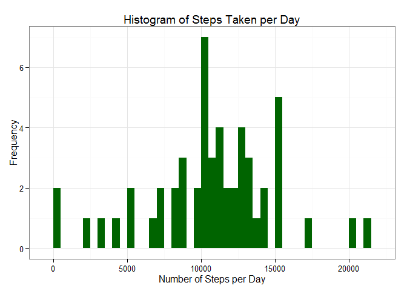
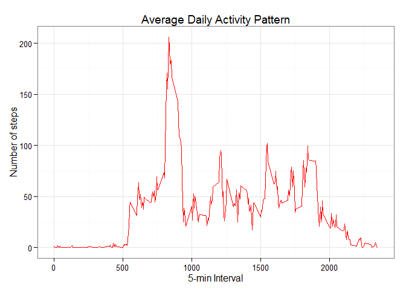
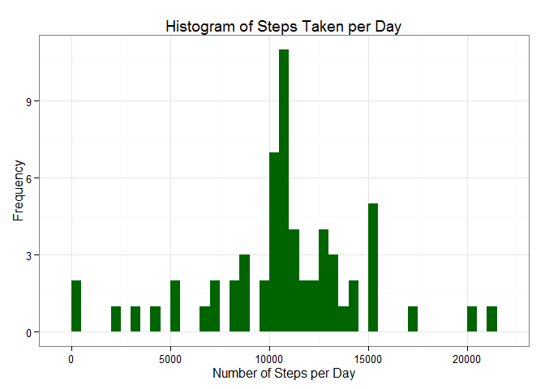
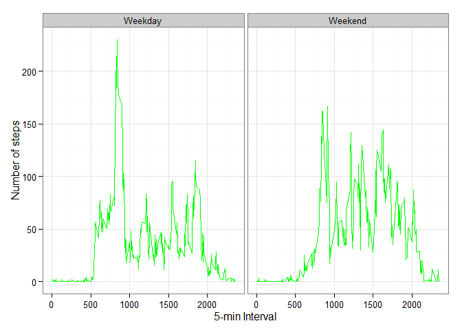

# Reproducible Research: Peer Assessment1
Elim Chen  
Thuesday, February 10, 2015  

## Introduction

This assignment makes use of data from a personal activity monitoring device. This device collects data at 5 minute intervals through out the day. The data consists of two months of data from an anonymous individual collected during the months of October and November, 2012 and include the number of steps taken in 5 minute intervals each day.

####0. Setting Global Options


```r
library(knitr)
opts_chunk$set(echo = TRUE)
```

####1. Loading and preprocessing the data


```r
Dir <- "data"
if (!file.exists(Dir)) {   ## check if newDirectory exist, if not 
    dir.create(Dir)          ## create the directory
  }
 
  fileName <- "activity.csv"  
  Path <- file.path(".",Dir)
  File <- file.path(Path, fileName)
  Data <- read.csv(File, sep = ",", header = TRUE, colClasses=c("numeric", "character", "numeric"))  ## READ CSV FILE
```

####2.  What is mean total number of steps taken per day?

For this part of the assignment, you can ignore the missing values in the dataset.

  - **Calculate the total number of steps taken per day**
  

```r
xDate <- aggregate(steps ~ date, sum, data = Data, na.rm=TRUE)
xDate
```

```
##          date steps
## 1  2012-10-02   126
## 2  2012-10-03 11352
## 3  2012-10-04 12116
## 4  2012-10-05 13294
## 5  2012-10-06 15420
## 6  2012-10-07 11015
## 7  2012-10-09 12811
## 8  2012-10-10  9900
## 9  2012-10-11 10304
## 10 2012-10-12 17382
## 11 2012-10-13 12426
## 12 2012-10-14 15098
## 13 2012-10-15 10139
## 14 2012-10-16 15084
## 15 2012-10-17 13452
## 16 2012-10-18 10056
## 17 2012-10-19 11829
## 18 2012-10-20 10395
## 19 2012-10-21  8821
## 20 2012-10-22 13460
## 21 2012-10-23  8918
## 22 2012-10-24  8355
## 23 2012-10-25  2492
## 24 2012-10-26  6778
## 25 2012-10-27 10119
## 26 2012-10-28 11458
## 27 2012-10-29  5018
## 28 2012-10-30  9819
## 29 2012-10-31 15414
## 30 2012-11-02 10600
## 31 2012-11-03 10571
## 32 2012-11-05 10439
## 33 2012-11-06  8334
## 34 2012-11-07 12883
## 35 2012-11-08  3219
## 36 2012-11-11 12608
## 37 2012-11-12 10765
## 38 2012-11-13  7336
## 39 2012-11-15    41
## 40 2012-11-16  5441
## 41 2012-11-17 14339
## 42 2012-11-18 15110
## 43 2012-11-19  8841
## 44 2012-11-20  4472
## 45 2012-11-21 12787
## 46 2012-11-22 20427
## 47 2012-11-23 21194
## 48 2012-11-24 14478
## 49 2012-11-25 11834
## 50 2012-11-26 11162
## 51 2012-11-27 13646
## 52 2012-11-28 10183
## 53 2012-11-29  7047
```
  -  **Make a histogram of the total number of steps taken each day**
  

```r
library(ggplot2)
ggplot(xDate, aes(x = steps)) + 
       geom_histogram(fill = "darkgreen", binwidth = 500) + 
        labs(title="Histogram of Steps Taken per Day", 
             x = "Number of Steps per Day", y = "Frequency") + theme_bw() 
```

 

  - **Calculate and report the mean and median of the total number of steps taken per day**
  

```r
############# Mean of total number of steps taken per day #############

mean(xDate$steps, na.rm = TRUE)
```

```
## [1] 10766.19
```

```r
############# Median of total number of steps taken per day #############

median(xDate$steps, na.rm = TRUE)
```

```
## [1] 10765
```

####3. What is the average daily activity pattern?
   -  **Make a time series plot (i.e. type = "l") of the 5-minute interval (x-axis) and the average number of steps taken, averaged across all days (y-axis)**
   

```r
xInterval <- aggregate(steps ~ interval, mean, data = Data, na.rm=TRUE)

ggplot(xInterval, aes(x=interval, y=steps)) +   
        geom_line(color="red") +  
        labs(title="Average Daily Activity Pattern", x="5-min Interval", y="Number of steps") +  
        theme_bw()
```

 

  - **Which 5-minute interval, on average across all the days in the dataset, contains the maximum number of steps?**
  

```r
max_Steps <- xInterval[which.max(xInterval$steps),1]
max_Steps
```

```
## [1] 835
```

####4.  Imputing missing values

Note that there are a number of days/intervals where there are missing values (coded as NA). The presence of missing days may introduce bias into some calculations or summaries of the data.

  - **Calculate and report the total number of missing values in the dataset (i.e. the total number of rows with NAs)**
  
    

```r
MissingDays <- sum(is.na(Data$steps))
MissingDays
```

```
## [1] 2304
```

  - **Devise a strategy for filling in all of the missing values in the dataset. The strategy does not need to be sophisticated. For example, you could use the mean/median for that day, or the mean for that 5-minute interval, etc.**
  

```r
x_na <- Data[is.na(Data$steps),]
Imputing_missing_values_dat <- merge(xInterval, x_na, by = "interval")
```

  - **Create a new dataset that is equal to the original dataset but with the missing data filled in.**
  

```r
library(dplyr)
```

```
## 
## Attaching package: 'dplyr'
## 
## The following object is masked from 'package:stats':
## 
##     filter
## 
## The following objects are masked from 'package:base':
## 
##     intersect, setdiff, setequal, union
```

```r
names(Imputing_missing_values_dat)[2] <- paste("steps")
Imputing_missing_values_dat <- select(Imputing_missing_values_dat,steps, date, interval)
Complete.Case.Dat <- subset(Data,!is.na(Data$steps))
newDataSet <- rbind(Complete.Case.Dat,Imputing_missing_values_dat)
Dat <- arrange(newDataSet, date, interval)  # sort date first then interval
```

  - **Make a histogram of the total number of steps taken each day and Calculate and report the mean and median total number of steps taken per day.** 


```r
xNew <- aggregate(steps ~ date, sum, data = Dat)
ggplot(xNew, aes(x = steps)) + 
       geom_histogram(fill = "darkgreen", binwidth = 500) + 
        labs(title="Histogram of Steps Taken per Day", 
             x = "Number of Steps per Day", y = "Frequency") + theme_bw() 
```

 

```r
############# Mean of total number of steps taken per day #############

mean(xNew$steps)
```

```
## [1] 10766.19
```

```r
############# Median of total number of steps taken per day #############

median(xNew$steps)
```

```
## [1] 10766.19
```

  - **Do these values differ from the estimates from the first part of the assignment? What is the impact of imputing missing data on the estimates of the total daily number of steps?**

The mean remain the same 10766.19 before & after the imputation while the median is 1.19 steps higher than before the imputation and equal to the mean: 10766.19 vs 10765; 


Compare to the first part of the assignmetn,  the impact of imputing missing values has increase the peak.

####5.  Are there differences in activity patterns between weekdays and weekends?

  - **Create a new factor variable in the dataset with two levels -- "weekday" and "weekend" indicating whether a given date is a weekday or weekend day.**


```r
WeekEnd <- c("Saturday","Sunday")
Dat <- mutate(Dat, day_group = as.factor(ifelse(is.element(weekdays(as.Date(date)),WeekEnd), "Weekend", "Weekday")))  
```

  - **Make a panel plot containing a time series plot (i.e. type = "l") of the 5-minute interval (x-axis) and the average number of steps taken, averaged across all weekday days or weekend days (y-axis). The plot should look something like the following, which was created using simulated data:**


```r
newInterval <- aggregate(steps ~ interval + day_group, Dat, mean)

ggplot(newInterval, aes(x=interval, y=steps)) + 
        geom_line(color="green") + 
        facet_wrap(~ day_group, nrow=1, ncol=2) +
        labs(x="5-min Interval", y="Number of steps") +
        theme_bw()
```

 

  
